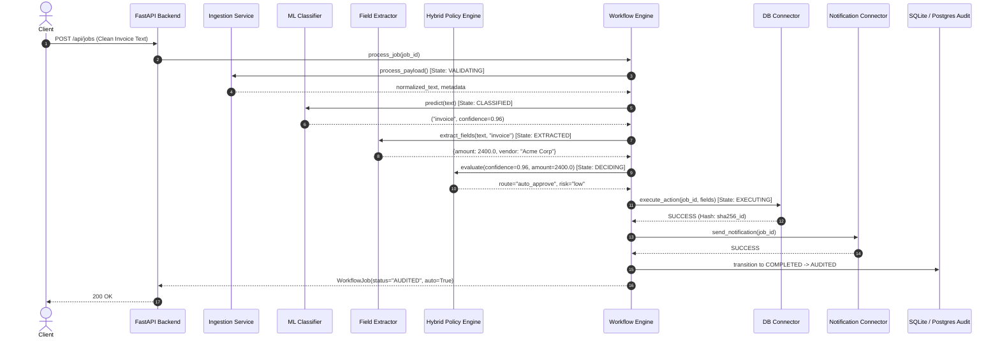
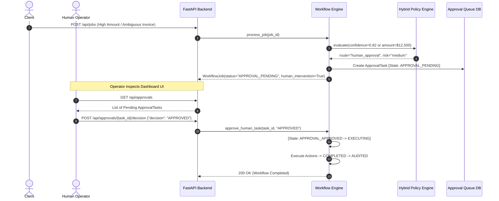
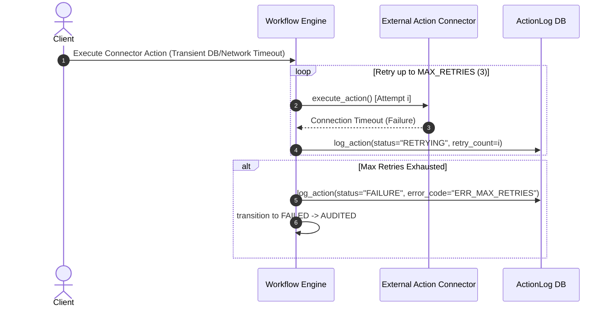

# System Architecture & State Machine Specification (Semester 1 Master Spec)

## 1. Architectural Overview & Component Boundaries

```text
  ┌─────────────────────────────────────────────────────────────┐
  │                    INPUT SOURCES                            │
  │     (REST API Payload / PDF Document Upload / Form)         │
  └──────────────────────────────┬──────────────────────────────┘
                                 │
                                 ▼
  ┌─────────────────────────────────────────────────────────────┐
  │                    INGESTION SERVICE                        │
  │     (Text Extraction / PDF Metadata / Field Normalizer)     │
  └──────────────────────────────┬──────────────────────────────┘
                                 │
                                 ▼
  ┌─────────────────────────────────────────────────────────────┐
  │                     AI / ML LAYER                           │
  │   - Task Classification (TF-IDF + Logistic Regression)      │
  │   - Field Extraction & Entity Parser with Field Confidence  │
  │   - Calibrated Confidence Score ($0.00 - 1.00$)             │
  └──────────────────────────────┬──────────────────────────────┘
                                 │
                                 ▼
  ┌─────────────────────────────────────────────────────────────┐
  │                   HYBRID POLICY ENGINE                      │
  │   - Evaluate AI predictions against Business Policy Rules   │
  │   - Confidence Threshold Safety Gate:                       │
  │       * ≥ 0.90 & Policy Pass  ──► Auto-Approve              │
  │       * 0.70-0.89 or Policy Flag──► Escalate to Human Queue │
  │       * < 0.70 or Policy Fail ──► Reject / Manual Review   │
  └──────────────────────────────┬──────────────────────────────┘
                                 │
                                 ▼
  ┌─────────────────────────────────────────────────────────────┐
  │                WORKFLOW STATE MACHINE                       │
  │   State Transitions & Execution Orchestrator                │
  └──────────────────────────────┬──────────────────────────────┘
                                 │
            ┌────────────────────┴────────────────────┐
            ▼                                         ▼
  ┌───────────────────┐                     ┌───────────────────┐
  │ ACTION CONNECTORS │                     │ HUMAN APPROVAL UI │
  │ DB Update / Mail  │                     │ Decision Review   │
  └─────────┬─────────┘                     └─────────┬─────────┘
            │                                         │
            └────────────────────┬────────────────────┘
                                 │
                                 ▼
  ┌─────────────────────────────────────────────────────────────┐
  │                   AUDIT & OBSERVABILITY                     │
  │   Workflow Logs / State History / Analytics Dashboard       │
  └─────────────────────────────────────────────────────────────┘
```

---

## 2. State Machine Lifecycle
```text
RECEIVED ──► VALIDATING ──► CLASSIFIED ──► EXTRACTED ──► DECIDING 
                                                             │
                  ┌──────────────────────────────────────────┴──────────────────────────┐
                  ▼                                                                     ▼
           [Auto-Approved]                                                      [Escalated / Review]
                  │                                                                     │
                  ▼                                                                     ▼
              EXECUTING ◄───────────────── APPROVAL_APPROVED ───────────── APPROVAL_PENDING
                  │                                                                     │
                  ├──────────────────────────────────────────────┐                      │ (If Rejected)
                  ▼                                              ▼                      ▼
              COMPLETED                                       FAILED ◄──────────── APPROVAL_REJECTED
                  │                                              │
                  └──────────────────────┬───────────────────────┘
                                         ▼
                                      AUDITED
```

---

## 3. Sequence Diagrams

### Sequence 1: Successful Invoice Auto-Approval Workflow


### Sequence 2: Human Escalation & Approval Workflow


### Sequence 3: Failure & Retry Handling Workflow


---

## 4. Formal Hybrid Decision Matrix

| AI Confidence Range | Policy Risk Level | Mandatory Fields Status | Assigned Route | Action Executed |
| :---: | :---: | :---: | :---: | :--- |
| $\ge 0.90$ | Low ($\text{Amount} \le \$5,000$, Known Vendor) | Complete | `auto_approve` | Automated DB Ledger Update + Notification |
| $\ge 0.90$ | Medium/High ($\text{Amount} > \$5,000$) | Complete | `human_approval` | Route to Approval Queue (Safety Override) |
| $0.70 \le \text{Conf} < 0.90$ | Any Risk Level | Complete | `human_approval` | Route to Approval Queue (Uncertainty Escalation) |
| $< 0.70$ | Any Risk Level | Any | `reject` | Reject / Manual Re-intake Required |
| Any Confidence | High (`MISSING_VENDOR`, Zero Amount) | Incomplete | `human_approval` | Route to Approval Queue (Missing Critical Data) |
